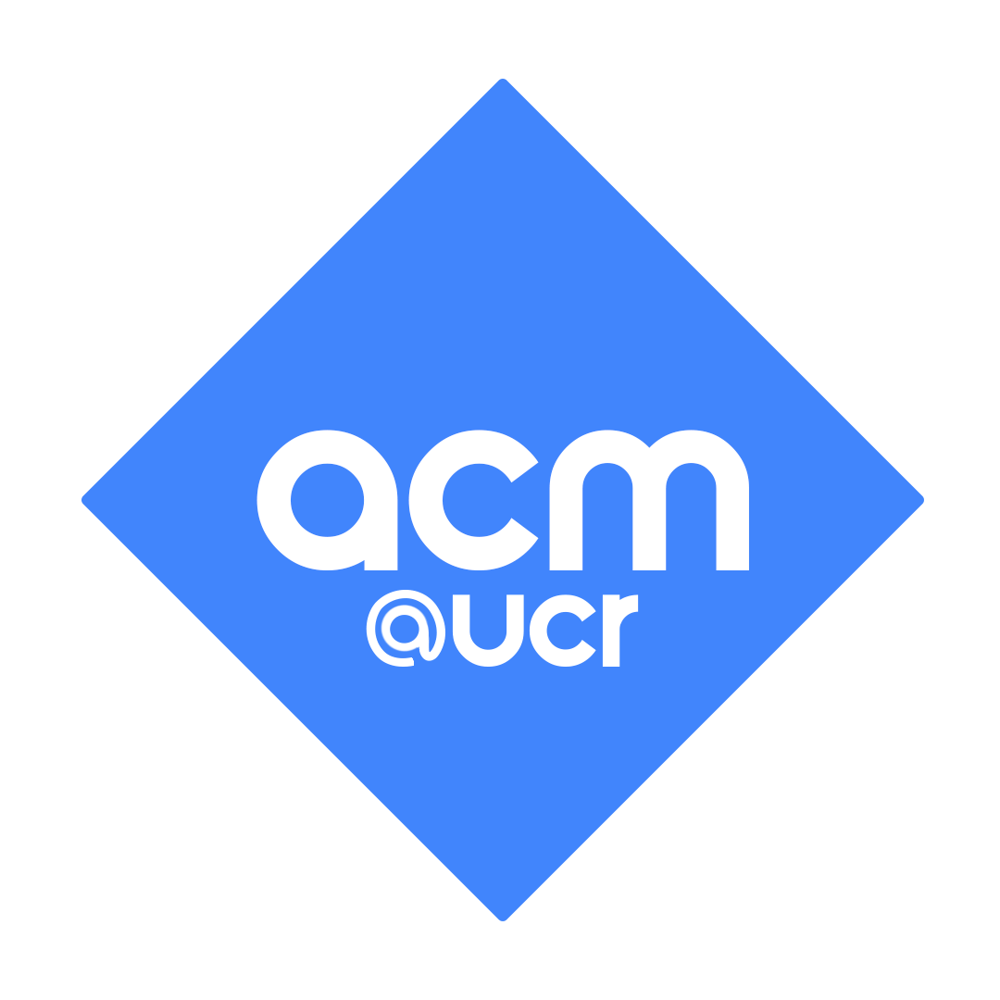
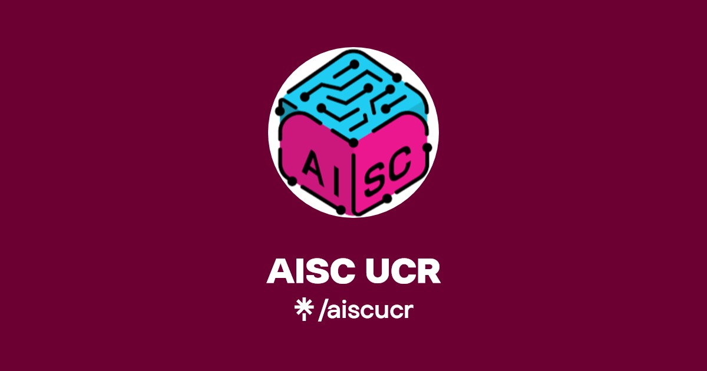
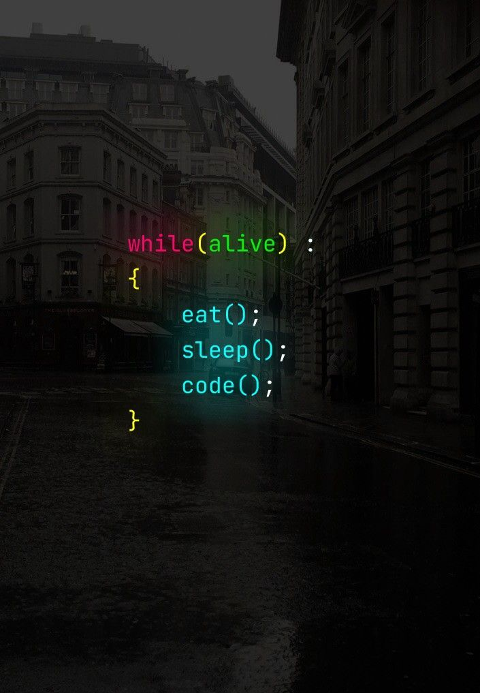

  

    
  

  

    <h1 style="margin: 0;">Explore what I'm building!</h1>
  

<h1 align="left"> > Built with caffeine and curiosity.</h2>

## 🔍 Projects

| 🏛️ Org  | 📂 Project | 📝 Description |
|-------------|------------|----------------|
|  | [Amazon_sales.ipynb](./Copy_of_ACM_DAS.ipynb) | Forecasting weather with predictive models and time series forecasting. |
|  | [AL_Stock_Price_Predictor.ipynb](./AL_Stock_Price_Predictor.ipynb) | Forecasting stock index prices using time series models. |
|  | [EDA_Parkinsons_Risk.ipynb](./EDA_Parkinsons_Risk.ipynb) | Parkinson’s risk prediction using SVM and vocal biomarker datasets. |

<h1 align="center"> Personal Projects

  

  

